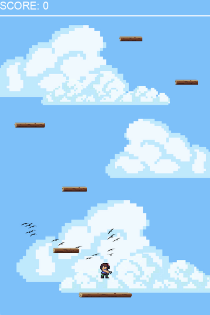
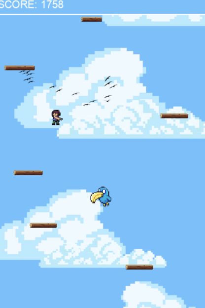

<h1 align="center">1 Hop 2 Hop  (+[__]∙:∙)</h1>
<h3 align="center">Made by Brigitte L1AC - 2602119190</h3>

#

## Description of the Project 🥸
1 Hop 2 Hop is an endless platform game that is heavily inspired by the classic arcade game ‘Frogger,’ also mixed with the games I used to play on my iPod when I was younger. 

In order to play the game, the user controls the avatar using the A and D keys to move left and right. To avoid falling, which eventually will close your score and end the current game, the user should try to land on the wood planks. When the user reaches a minimum score of 1500 points, new obstacles are generated and the player should try to avoid it. 

    
    

#

## Demo Video 👩🏻‍💻
https://shorturl.at/bmsEP

## Libraries and Modules Used 📖
- Pygame: library filled with Python modules and functions (like sprites) designed for making 2D video games.
- Random: module that implements pseudo-random number generators for various distributions (for the generating of the random lengths of the wood planks and their positions and the final score).
- Os: module that provides functions for creating and removing a directory (folder), fetching its contents, changing and identifying the current directory, etc.

## Running the Game on VSCode ⚙️
1. Download the zip file of this repository.
2. Extract it and open the folder on your VSCode.
3. Go to the hop.py file and run the Python file. Make sure to have pygame installed as well.